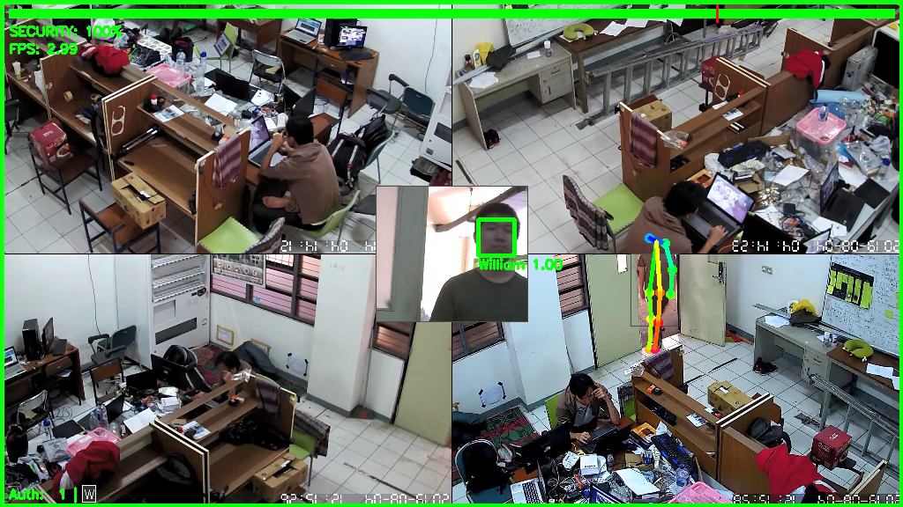
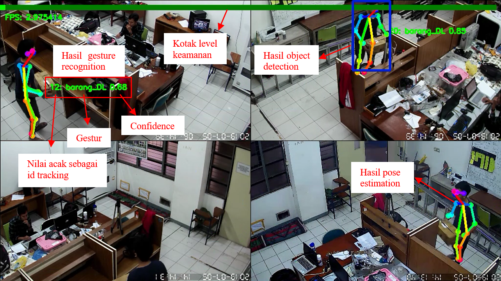


## Behavior Detection Security System

Final iteration of the program.


Previous iteration of the program, before the authorization functionality fully implemented (face recognition paired with clothes identification).


*In the process of migrating. Complete documentations and demo can be seen in `docs/` directory.*

@@@@

## Objectives

The aims of this experiment are:

-  @@@@

The workflow, certain configurations, and basic information here is based on https://github.com/stuarteiffert/RNN-for-Human-Activity-Recognition-using-2D-Pose-Input, with the network used there based on that of Guillaume Chevalier, 'LSTMs for Human Activity Recognition, 2016'  https://github.com/guillaume-chevalier/LSTM-Human-Activity-Recognition, available under the MIT License.

## Dataset overview

The dataset consists of pose estimations, made using the software OpenPose (https://github.com/CMU-Perceptual-Computing-Lab/openpose's) on a set of personally created human activity dataset.

A summary of the dataset used for input is:

 - @@@@ individual images 
 - n_steps = @@@@ frames (~=@@@@ at @@@@Hz)
 - Training_split = 0.5
 - Overlap = @@@@ (2 / 5) ie 2 frame overlap
   - Length X_train = @@@@ frames
   - Length X_test = @@@@ frames
   

## Training and Results below: 
Training took app@@@@

## Preparing dataset:

1. @@@@
2. @@@@

## Set Parameters:

1. @@@@
2. @@@@

## Train the network:

1. @@@@
2. @@@@

## Results:

@@@@

## Conclusion

Final accuracy of >90% is pr @@@@

## Future Works

Inclusion of:

 - @@@@

## Extra stuffs below: 
Training took app@@@@

## Preparing Yoosee IP Camera:

Below are the steps to connect the Yoosee P2P IP Camera which are used in this project.

1. Using a smartphone, download the Yoosee application
2. Connect your smarphone to a router (WiFi) the cams are going to connect through.
3. In the app, add device by pressing the "+" button > Add new device > Smartlink.
4. Make sure the WiFi detected here. If not, try to activate your phone GPS/location.
5. Note that 5 GHz is not accepted here. Also tethering from your phone/PC is also usable, but not recommended.
6. Reset the IP Camera by pressing the small button under it. Wait for a moment until it's ready to accept configuration (some might indicate you using by "du du du", "waiting for configuration", but other might just only a small audio cue).
7. Make sure your phone is not muted
8. Follow the instruction on your phone app until it produces a high pitched sound.
9. Bring the phone closer to the cam, and wait until they produce another/different sound cue (some says "configuration...", other just fast "zing" sound)
10. Quickly press back on your phone or close the app to make sure the app is not the one binding the camera (once bind, the app would scramble the camera's default password, thus inaccessible from the PC).
11. If the camera is connected to the same WiFi as the PC, the camera would appear automatically in one of those PC programs:
- Onvif Device Manager
- IPCTestTool (in Chinese)
- CMSClient (not as reliable as camera finder)

12. For CMSClient, click the "+" button and the devices should be automatically listed in the table on the left side. Add them.
13. The device should be listed in the Device List. Double click them to preview.
14. If the camera is listed but inaccessible, the camera might has been bind to the phone and having the password changed from its default one.
15. You can later change the IP to a static one using the CMSClient or assign one through the access point configuration.
16. Through CMSClient, stop adn then right click the device on the device list.
17. Set both to default values, which are "123".
18. Right click the device again, IPC config, "Use the following IP address".
19. It'd be greyed out if the password you input before is invalid, such as being changed to a random value by the phone program.
20. Now you can access the camera through RTSP using this link format:
rtsp://<IPADDR>:554/onvif1
21. You can also use VLC media player to play it. For python, use WebcamVideoStream from Imutils (multi-threading) or VideoCapture from OpenCV (Traditional single thread).
22. In case you got some UDP/TCP problems, run the "UDP_OPENCV.bat" to set OpenCV to use UDP (by default it's TCP).


Other ways would require the camera connected to a router through LAN, and further configure from there on.

Forum to help going through the process: https://support.yooseecamera.com/forums/6/

## References

The basic workflow and parameters/configurations in this experiment for gesture recognition is based on the following:
> Stuarteiffert, RNN for Human Activity Recognition - 2D Pose Input, 2018
> https://github.com/stuarteiffert/RNN-for-Human-Activity-Recognition-using-2D-Pose-Input


Which is based on the following, available under the [MIT License](https://github.com/guillaume-chevalier/LSTM-Human-Activity-Recognition/blob/master/LICENSE):
> Guillaume Chevalier, LSTMs for Human Activity Recognition, 2016
> https://github.com/guillaume-chevalier/LSTM-Human-Activity-Recognition

Face recognition is based on the following:
> Adam Geitgey, Modern Face Recognition with Deep Learning, 2016
> https://medium.com/@ageitgey/machine-learning-is-fun-part-4-modern-face-recognition-with-deep-learning-c3cffc121d78

Pose estimation is based on the following:

> CPU Perceptual Computing Lab, OpenPose - Real-time multi-person keypoint detection library for body, face, hands, and foot estimation, 2017
> https://github.com/CMU-Perceptual-Computing-Lab/openpose

```
